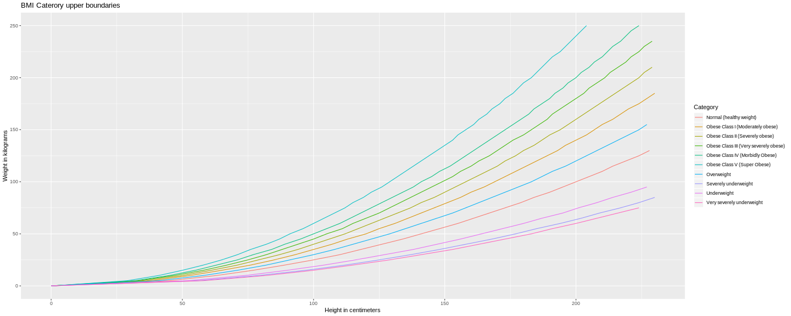

ShinyBMI
========================================================
author:Claus Bo Hansen 
date: 219-10-16
autosize: true
width: 1600
height: 900

<style>
.small-code pre code {
  font-size: 1em;
}
</style>

Idea
========================================================

The idea of ShinyBMI is to make Body Mass Index (BMI) calculation available to everyone.  
ShinyBMI will quickly provide you with your BMI without storing any of your personal information.

You can try out ShinyBMI for your self by visiting <https://clausbohansen.shinyapps.io/ShinyBMI/>  

If you in a situation, where you can't access the online calculator, you can print this presentation.  
It contains a diagram you can use to determine your BMI category.


A code push-up
========================================================
class: small-code

To be able to plot the BMI classes for you, we need to prepare a little data frame with data to plot.


```r
# Load libraries
library(dplyr)
library(ggplot2)

# Define data frame for data to plot
plotdata <- data.frame()

# These are upper boundaries for each category
BMIboundaries <- c('Very severely underweight' = 15,
                  'Severely underweight' = 16,
                  'Underweight' = 18.5,
                  'Normal (healthy weight)' = 25,
                  'Overweight' = 30,
                  'Obese Class I (Moderately obese)' = 35,
                  'Obese Class II (Severely obese)' = 40,
                  'Obese Class III (Very severely obese)' = 45,
                  'Obese Class IV (Morbidly Obese)' = 50,
                  'Obese Class V (Super Obese)' = 60)

# Calculate height for each class
for (Weight in seq(0, 250, 5)){
  for (i in 1:length(BMIboundaries)){
    plotdata <- rbind(plotdata,
      list(Weight = Weight,
           Height = round(100*sqrt(Weight/BMIboundaries[i])),
           Category = names(BMIboundaries[i])),
        stringsAsFactors = FALSE)
  }
}

# Remove unrealistic heights
plotdata <- plotdata %>%
  filter(Height <= 230)
```


Printable BMI category boundaries for off-line use
========================================================
class: small-code

This little chuck gives you a BMI category chart:

```r
ggplot(plotdata, aes(x=Height, y=Weight, color=Category)) +
  geom_line() +
  labs(title="BMI Caterory upper boundaries", x = "Height in centimeters", y="Weight in kilograms")
```




References
========================================================

Definition of BMI Classes  
<https://en.wikipedia.org/wiki/Body_mass_index>

